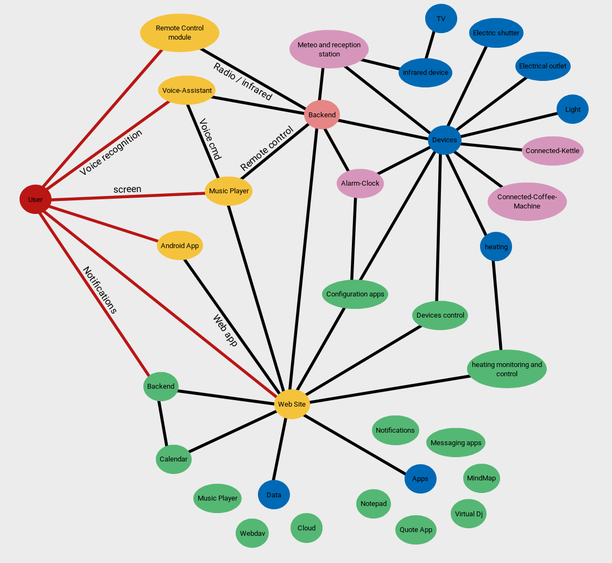

# aya-assistant
vocal assistant for home automation

  
  
  <em>AIA Project</em>

## functions

* voice recognition and speak
* keyword detection
* radio receiver and transmitter
* music player
* web control with 
* webcam

## composed

* raspberry pi 2
* google voice hat v1
* 2 speakers
* 7 inches toutch screen
* DHT22, BMP280 sensors (altitude, pressure, temperature, humidity)
* 433mHz radio receiver and transmitter (radio-controlled devices)
* hc12 serial radio receiver and transmitter (alarms, kettle,...)
* toutch sensors
* signal leds
* webcam server

### voice functions

* get agenda events
* get notifications
* controls devices
* translate sentence
* get sensor measurements
* tells jokes
* controls the music
* gives the meteo
* questions / answers
* ...

__futur devellopement__

* aya-alarm's control
* set new agenda event
* get actualities

### screen

the raspberry show the domotix web page on chromium browser

### music player

the assistant reads the music on domotix server when they aren't not in a local file. You can add your music directly to the server. 

## install

* install google voice raspbian image
* execute installRpi.sh
* execute autostart/installAyaServerService.sh
* create and copy assistant.json and copy in /home/user/ path 
* complete assistantFuction/conversation.json

### techno

* keyword detection (pocketsphinx)
* gives the meteo (weather-api)
* translate (googletrans)
* webcam server (cherrypy)
* music player (vlc)
